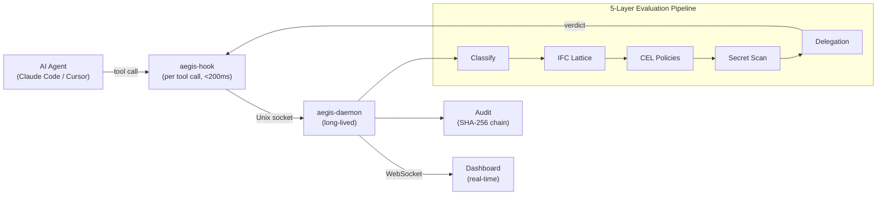

# Aegis

**Real-time governance engine for AI coding agents.**

Aegis intercepts every tool call your AI assistant makes — file writes, shell commands, network access — and evaluates it against security policies in under 200ms. If the action violates policy, Aegis blocks it before execution. No prompt engineering. No trust assumptions. External enforcement.

## The Problem

AI coding agents (Claude Code, Cursor, Copilot) have unrestricted tool access. They can:

- Read `.env` and `curl` credentials to an external server
- `rm -rf` your repository
- Open reverse shells via `nc -e /bin/sh`
- Install malicious packages via typosquatting
- Escalate privileges with `chmod 777` or `sudo`

The only guardrail today is hoping the model says no. Aegis enforces externally — the model cannot bypass it because the hook intercepts at the tool-call boundary *before* execution.

## Architecture



**Three binaries, one principle:**

| Binary | Role | Why separate? |
|--------|------|---------------|
| `aegis-hook` | Per-invocation, called by IDE on every tool call | Must be <200ms total. Can't afford daemon startup cost per call. |
| `aegis-daemon` | Long-lived process, holds compiled policies in memory | Amortizes CEL compilation. Manages audit, streaming, state. |
| `aegis` | CLI for offline operations (validate, simulate, scan, bundle) | No daemon dependency. Works in CI. |

## Key Capabilities

- **CEL Policy Engine** — Declarative YAML policies with [CEL](https://github.com/google/cel-go) expressions. Sub-3μs evaluation. Hot-reloadable.
- **Information Flow Control** — Bell-LaPadula + Biba security lattice. Tracks what data a session has seen and restricts where it can flow.
- **Secret Scanning** — Detects credentials in tool arguments before they reach the network. Powered by [gitleaks](https://github.com/zricethezav/gitleaks).
- **Delegation Chains** — Ed25519-signed permission escalation. Max depth 8, TTL expiry, declassification gates.
- **Tamper-Evident Audit** — SHA-256 hash-chained decision log. Any retroactive modification breaks the chain.
- **Real-Time Dashboard** — WebSocket-streamed governance events, security lattice visualization, delegation tree, policy playground.
- **gRPC ext_authz** — Drop-in Envoy/Istio integration for service mesh deployments.

## Why Not...

| Alternative | Why it's insufficient |
|---|---|
| Prompt engineering | The model decides whether to obey. Aegis enforces externally — the model has no bypass path. |
| IDE permission dialogs | Per-click approval doesn't scale to hundreds of tool calls per session. No policy language, no audit trail. |
| OPA / Gatekeeper | Designed for Kubernetes admission control. No session state, no IFC lattice, no sub-millisecond hook budget. |
| File permissions (chmod) | Coarse-grained. Can't distinguish "read config.yaml" from "read .env and exfiltrate via curl" |
| Sandboxing (containers) | Restricts capabilities, not intent. A sandboxed agent can still `rm -rf` inside its sandbox. |

## Quick Start

```bash
# Clone and build
git clone https://github.com/mayjain/aegis.git
cd aegis
go build -o bin/ ./cmd/...

# Start the daemon (uses built-in policies by default)
./bin/aegis-daemon

# In another terminal — simulate a tool call
./bin/aegis simulate Bash --args '{"command":"rm -rf /"}'
# → action=deny policy=block-rm-rf layer=cel latency=1601000ns
# → reason=Blocked: destructive rm -rf detected — potential prompt injection

# Launch the dashboard
cd dashboard && npm ci && npm run dev
# → http://localhost:5173
```

For IDE integration (Claude Code / Cursor hook configuration), see the [Getting Started Guide](docs/guide/getting-started.md).

## Policy Example

A built-in policy blocking reverse shell creation:

```yaml
apiVersion: aegis.io/v1
kind: PolicyTemplate
metadata:
  name: block-network-reverse-shell
spec:
  description: "Block reverse shell patterns"
  matchConstraints:
    tools: ["Bash"]
  variables:
    - name: isNetcatExec
      expression: >-
        request.args.command.matches("(?i)\\bn(c|cat)\\b.*\\s-[ec]\\s")
    - name: isBashTcpRedirect
      expression: >-
        request.args.command.matches("/dev/(tcp|udp)/")
  validations:
    - expression: 'isNetcatExec'
      message: 'Netcat with -e/-c is blocked — this creates a reverse shell'
      action: DENY
    - expression: 'isBashTcpRedirect'
      message: '/dev/tcp redirection is blocked — creates network backdoors'
      action: DENY
  defaultAction: ALLOW
```

**19 built-in policies** ship enabled by default, covering credential exfiltration, destructive commands, reverse shells, privilege escalation, supply chain attacks, and more. See [Policy Authoring Guide](docs/guide/policy-authoring.md).

## Performance

Full evaluation pipeline P99: **<10μs.** Hook round-trip budget: **200ms** (dominated by process startup and socket connect — policy evaluation itself is sub-microsecond on the hot path thanks to zero-allocation design and pre-compiled CEL programs).

## Evaluation

Aegis ships with a 784-case adversarial benchmark (`eval/`) covering 7 attack categories. Results against the current policy set:

| Category | Recall | Notes |
|----------|--------|-------|
| Direct attacks | 93% | Unobfuscated `rm -rf`, reverse shells, privilege escalation |
| Evasion techniques | 87% | Base64 encoding, variable expansion, multi-stage payloads |
| Delegation attacks | 80-86% | Forged chains, circular delegation, expired tokens |
| Taint propagation | 78% | Read-then-exfiltrate, cross-session taint |
| Label manipulation | 52% | IFC label spoofing — needs Go-level hardening |
| Protocol attacks | 18-38% | Wire-level abuse — needs Go-level changes, not more CEL |

**Overall precision: 92%** (roughly 1 in 12 deny decisions is a false positive — improvement ongoing).

The weakest categories (protocol attacks, label manipulation) require Go-level changes to the IFC and adapter layers, not additional CEL policies. Train/test gap is small (F1: 84% vs 80%) — no overfitting. See [eval/adversarial/EVAL_BENCH.md](eval/adversarial/EVAL_BENCH.md) for threat model, methodology, and per-case results.

## Documentation

| Guide | Audience |
|-------|----------|
| [Getting Started](docs/guide/getting-started.md) | Install, configure, integrate with your IDE |
| [Policy Authoring](docs/guide/policy-authoring.md) | Write custom policies, test with `aegis simulate` |
| [Architecture](docs/guide/architecture.md) | System design, concurrency model, performance |
| [Security Model](docs/guide/security-model.md) | IFC lattice, delegation chains, audit integrity |

## Contributing

See [CONTRIBUTING.md](.github/CONTRIBUTING.md). Prerequisites: Go 1.25+, Node 20+.

## License

[MIT](LICENSE) — Mayank Jain, 2026.
