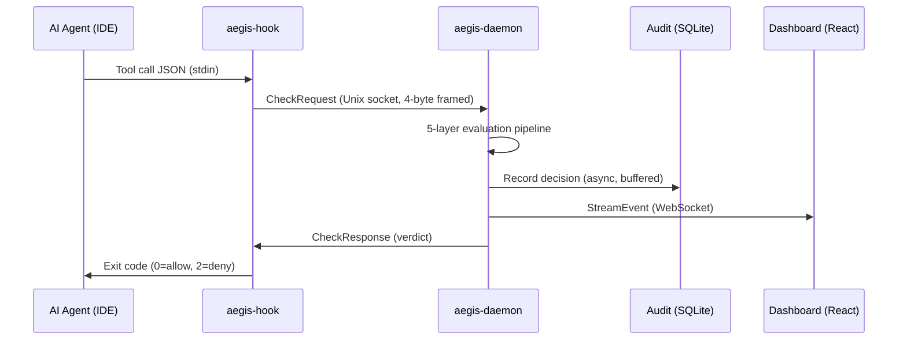
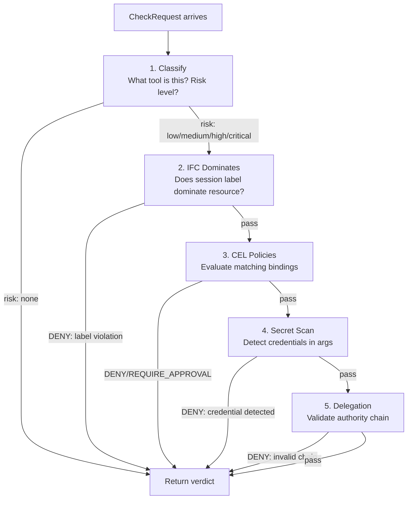
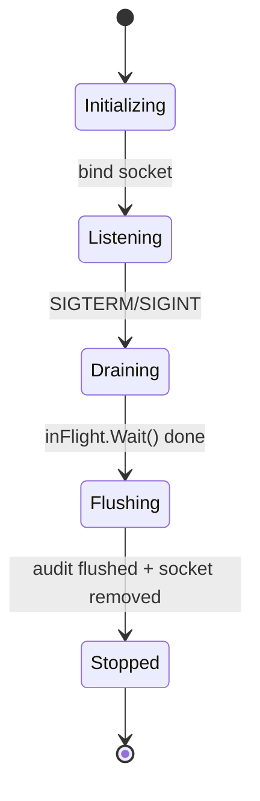
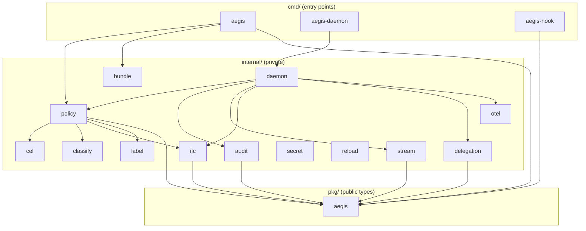

# Architecture

## System Overview

Aegis is split into three binaries that communicate via Unix domain socket:



### Why Three Binaries?

This is the same split pattern used by Docker (docker CLI / dockerd / containerd) and Kubernetes (kubectl / kube-apiserver / kubelet):

**`aegis-hook`** — Per-invocation. The IDE calls this on every tool call. It must:
- Start in <5ms (static binary, no runtime initialization)
- Complete round-trip in <200ms (the IDE's tolerance budget)
- Be small (~3MB) — loaded into memory on every tool invocation

It *cannot* hold compiled policies in memory because it exits after every call. The daemon amortizes that cost.

**`aegis-daemon`** — Long-lived. Holds:
- Pre-compiled CEL programs (expensive to build, microseconds to evaluate)
- Session state (IFC labels, taint history, standing rules)
- Audit writer goroutine
- WebSocket connections to the dashboard
- Hot-reload watcher

**`aegis` CLI** — Offline tooling. No daemon dependency. Works in CI pipelines.

## The 200ms Budget

Where time goes for a single tool call evaluation:

```
┌──────────────────────────────────────────────────────────────────────┐
│ Total: ~15-50ms typical (200ms hard budget)                          │
├──────────────────────────────────────────────────────────────────────┤
│ Hook startup (fork + exec)                         ~5-10ms           │
│ Unix socket connect                                ~0.5ms            │
│ JSON marshal + 4-byte frame write                  ~0.3ms            │
│ ─── daemon evaluation ───                                            │
│ │ Classify tool                                    ~0.1μs            │
│ │ IFC dominance check                             ~0.1μs            │
│ │ CEL expression evaluation                       ~1-3μs            │
│ │ Secret scan (if applicable)                     ~50-100μs         │
│ │ Delegation validation                           ~0.1μs            │
│ ─── end daemon ───                                                   │
│ JSON response read + unmarshal                     ~0.2ms            │
│ Remaining: IDE + OS scheduling overhead                              │
└──────────────────────────────────────────────────────────────────────┘
```

The evaluation itself (the daemon's work) takes <10μs P99 for the common case (no secret scan needed). The 200ms budget is almost entirely consumed by process startup and IPC overhead — which is why the daemon exists.

## 5-Layer Evaluation Pipeline

The pipeline is ordered intentionally — cheapest rejections first:



**Why this order?**

1. **Classify** — O(1) map lookup. Rejects known-safe tools immediately (no policy evaluation needed for read-only operations with zero risk).
2. **IFC** — Pure arithmetic (label comparison). Catches lattice violations without compiling/running any CEL.
3. **CEL** — The most expressive layer but also the most expensive (~1-3μs). Only reached for tool calls that pass IFC.
4. **Secret Scan** — Only invoked when the tool has side effects (network, write). Skipped for pure reads.
5. **Delegation** — Only invoked when the request carries an authority chain. Most requests don't.

## Concurrency Model

### Hot Path: Zero Allocations

The `Evaluate()` function is designed for zero heap allocations on the steady-state path:

```go
func (e *PolicyEngine) Evaluate(ctx context.Context, req aegis.CheckRequest) aegis.CheckResponse {
    snap := e.snapshot.Load()
    // ... all evaluation uses this snapshot pointer
}
```

- `atomic.Pointer[Snapshot]` — Lock-free snapshot access. Readers never block.
- Pre-compiled CEL programs — Compilation at reload time, not evaluation time.
- Value-type responses — `CheckResponse` returned by value, not heap-allocated.
- `sync.Pool` scratch buffers — Reused across evaluations.

### Atomic Snapshot Swap (INV-005)

Policy reload (triggered by fsnotify or explicit API call) is atomic:

```
1. Parse all YAML files → new PolicySet
2. Compile all CEL expressions → new Programs
3. Build binding index → new Snapshot
4. atomic.Pointer.Store(&newSnapshot)  ← ONE store, visible to all goroutines immediately
```

There is exactly ONE `atomic.Pointer.Store()` call in the codebase (in `applySnapshot()`). This is enforced by grep in CI. The invariant guarantees that no request is ever evaluated against a partially-loaded policy set.

### Reload Safety (INV-006, INV-007)

```
reloadMu.Lock()
  parse → compile → validate
  if err != nil {
    log.Error("reload failed, retaining previous snapshot")
    reloadMu.Unlock()
    return  // INV-007: failed reload never replaces snapshot
  }
  applySnapshot(newSnap)
reloadMu.Unlock()
// INV-006: reloadMu is NEVER held during Evaluate()
```

Concurrent evaluations proceed without blocking during reload. A broken policy file never takes down the running system. The reload mutex serializes reloads against each other, not reads.

### Single-Writer Audit (INV-008)

The audit subsystem uses a single-writer goroutine pattern:

```
                    ┌─────────────────────────────┐
  Evaluate() ──→   │ buffered channel (cap: 1024) │ ──→ Audit Writer Goroutine
  Evaluate() ──→   │                             │      │
  Evaluate() ──→   │                             │      ├─ Batch (64 records)
                    └─────────────────────────────┘      ├─ Compute chain hash
                                                         ├─ SQLite WAL write
                                                         └─ Flush every 100ms
```

- Evaluators never touch SQLite directly — they send to a channel
- If the channel is full, the record is dropped (counter incremented for metrics)
- The audit goroutine batches writes for throughput while computing chain hashes per-record for integrity

### Daemon Lifecycle



The daemon manages connections with a semaphore (`chan struct{}`) that bounds concurrent goroutines. Graceful shutdown:
1. Stop accepting new connections
2. Wait for in-flight evaluations (`sync.WaitGroup`)
3. Flush audit channel (drain remaining buffered records)
4. Remove socket file

## Streaming Architecture

The daemon streams governance events to the dashboard via WebSocket:

```
Daemon (single fan-out goroutine)
 ├── Client 1 (filter: tool=Bash)
 ├── Client 2 (filter: action=DENY)
 ├── Client 3 (no filter — all events)
 └── Client 4 (filter: latency>1ms)
```

**Wire format:** CloudEvents v1.0 with `aegissequence` extension (monotonic, gap-free sequence number per connection).

**Design decisions:**
- Single fan-out goroutine — avoids lock contention on the client list
- Server-side filtering — clients specify filters at connect time, server only sends matching events
- Per-client buffered channel with drop-oldest backpressure — slow clients don't block the fan-out
- Max 64 concurrent WebSocket connections (loopback-only, rate-limited)
- Heartbeat every 10s with sequence number for gap detection

## Package Dependency Graph



**Acyclic constraint:** The dependency graph is strictly acyclic. `internal/stream` cannot import `internal/audit` or `internal/policy` — this is enforced by `scripts/check-stream-isolation.sh` in CI.

**Why `pkg/aegis/` exists:** It defines the shared type vocabulary (`CheckRequest`, `CheckResponse`, `SecurityLabel`, `Action`, `StreamEvent`) that both the hook binary and the daemon consume. The hook binary only imports `pkg/aegis/` — it has no dependency on `internal/`.

## Key Invariants

| ID | Invariant | Enforced by |
|----|-----------|-------------|
| INV-001 | Zero-value `Action` is `ActionDeny` (fail-secure) | Type definition: `ActionDeny = 0` |
| INV-005 | `atomic.Pointer.Store()` appears exactly once | CI grep check |
| INV-006 | `reloadMu` never held during `Evaluate()` | Code structure: separate paths |
| INV-007 | Failed reload never replaces the snapshot | Error check before `Store()` |
| INV-008 | SQLite audit writes happen on single goroutine | Channel architecture |
| INV-009 | Chain hash computed per-record before batch write | Audit writer implementation |
| INV-010 | Hook fail-open: unreachable daemon = ALLOW (logged) | Hook fallback path |
| INV-011 | No allocation in `Evaluate()` steady-state | Benchmark regression tests |
| INV-012 | Policy reload is atomic (all-or-nothing) | Snapshot swap pattern |

## Performance Targets

Verified by `scripts/verify-benchmarks.sh` in CI:

| Component | Target | Mechanism |
|-----------|--------|-----------|
| CEL evaluation | <3μs | Pre-compiled programs, no reflection |
| Delegation validation | <100ns | Ed25519 verify with cached keys |
| IFC dominance check | <100ns | Integer comparison (no allocation) |
| OTel disabled overhead | <50ns | Compile-time noop when endpoint unset |
| Secret scan | <100μs | Gitleaks with pre-compiled rules |
| Full pipeline P99 | <10μs | All layers combined (without secret scan) |

## Design Decisions

For the full decision log, see `docs/planning-corpus/03_DECISION_REGISTRY.md`. Key highlights:

- **Unix socket over TCP** — Lower latency (~0.5ms vs ~2ms), no TCP overhead, filesystem permissions for access control.
- **CEL over Rego/Wasm** — CEL compiles to native Go, sub-microsecond evaluation. Rego requires an interpreter. Wasm adds serialization overhead.
- **SQLite over Postgres for audit** — Single-file deployment, no external dependencies, WAL mode gives concurrent read performance. Scales to millions of records for single-machine use.
- **CloudEvents wire format** — Standard envelope, tooling ecosystem (schema registry, event routers), forward-compatible with distributed deployment.
- **fsnotify over polling** — Immediate reload on file save (~1ms) vs polling interval (typically 1-5s). Lower CPU usage.

## Reproducing Benchmarks

Run component-level benchmarks:

```bash
# CEL evaluation (target: <3μs)
go test -bench BenchmarkEvaluate -benchmem ./internal/policy/

# IFC dominance check (target: <100ns)
go test -bench BenchmarkDominates -benchmem ./internal/ifc/

# Delegation validation (target: <100ns)
go test -bench BenchmarkValidate -benchmem ./internal/delegation/

# All benchmarks
go test -bench . -benchmem ./internal/...
```

Run the adversarial evaluation (requires daemon running):

```bash
# Start daemon in one terminal
./bin/aegis-daemon

# Run eval suite (784 cases across 7 categories)
cd eval/adversarial && ./run_eval.sh
```

Performance targets are mechanically verified in CI via `scripts/verify-benchmarks.sh`. A regression that exceeds the target fails the build.
